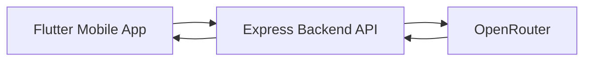
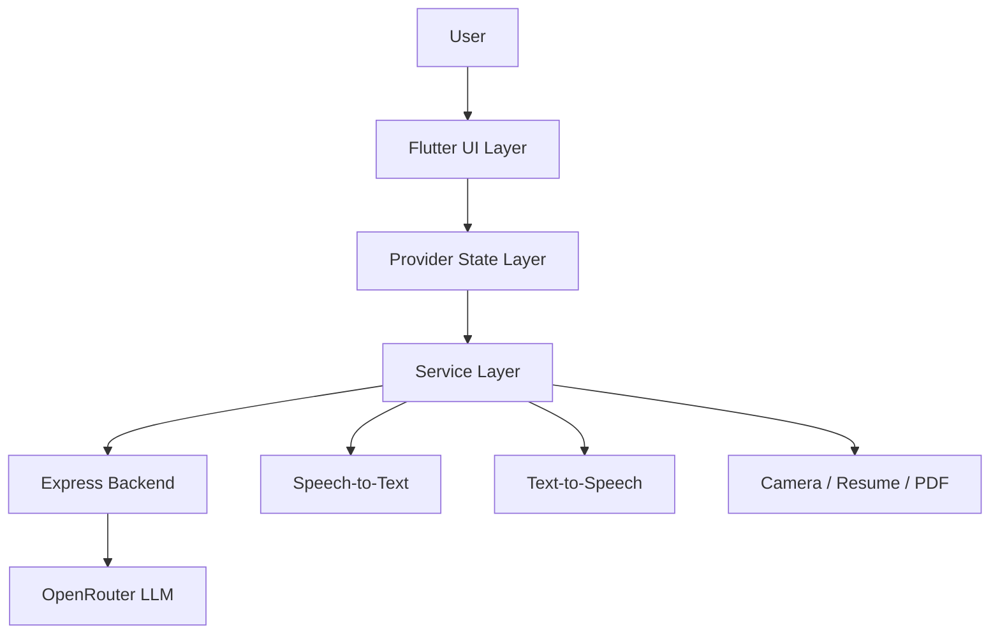
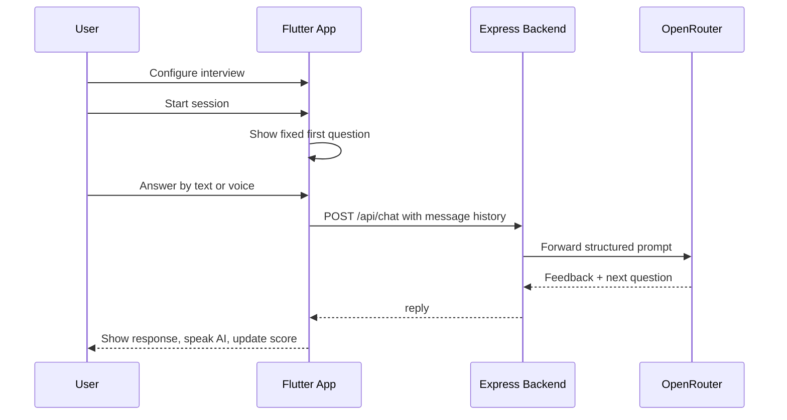
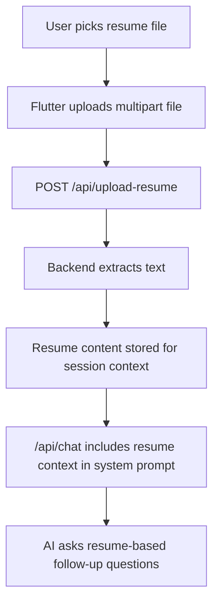

# Welp.Ai

Welp.Ai is a mobile-first AI interview simulator built to help users practice realistic job interviews with conversational AI, voice input, resume-aware questioning, automated scoring, and polished post-session feedback.

The project was designed as a strong portfolio-quality product: not just a UI demo, but a full-stack application with a Flutter frontend, an Express backend, and a hosted LLM integration layer through OpenRouter.

## Why We Built It

Job interview preparation is often inconsistent, expensive, and difficult to personalize. Most candidates either:

- practice alone without feedback
- rely on generic question lists
- pay for mock interview services
- or use tools that do not feel like a real conversation

Welp.Ai was built to solve that gap with a smoother and more interactive experience:

- simulate a real interviewer
- let users answer by voice or text
- tailor follow-up questions using resume context
- provide immediate feedback and scoring
- create a report users can review or share

## Product Goals

- Create a realistic interview experience on mobile
- Keep the AI flow natural and conversational
- Support voice-first usage for hands-free practice
- Personalize questions using uploaded resume content
- Provide actionable feedback, not just a chat transcript
- Keep the architecture clean enough to scale beyond a demo

## What the App Does

Welp.Ai allows a user to:

- log in through a lightweight demo access flow
- configure an interview mode, role, difficulty, persona, and question count
- upload a resume file for context-aware questioning
- start an AI interview session
- answer questions using text or speech-to-text
- hear AI questions through text-to-speech
- optionally use camera context during the session
- receive feedback and a score throughout the interview
- review strengths, weaknesses, and suggestions at the end
- export the session summary as a PDF

## Tech Stack

### Frontend

- Flutter
- Provider for state management
- Dio for API communication
- `speech_to_text` for voice transcription
- `flutter_tts` for text-to-speech playback
- `camera` for live preview and lightweight coaching triggers
- `file_picker` for resume upload
- `pdf` and `printing` for report generation

### Backend

- Node.js
- Express
- CORS
- Multer for multipart file uploads
- OpenRouter for LLM access
- Resume text extraction for `.txt` and `.pdf` content

### Deployment

- Flutter Android release build
- Render-hosted backend
- Production API endpoint:
  - `https://welp-ai.onrender.com`

## System Architecture

The app follows a layered flow where the mobile client never talks to the LLM provider directly.



This separation is intentional:

- API keys stay on the backend
- prompts can be controlled server-side
- resume context can be injected safely
- fallback logic can be handled centrally
- Flutter stays focused on UX, state, and device capabilities

## High-Level Architecture Breakdown



### Flutter Responsibilities

- screen rendering
- local state updates
- voice and device integrations
- navigation
- session UX and presentation

### Backend Responsibilities

- secure AI request handling
- prompt construction
- resume upload and parsing
- context injection for interviews
- model abstraction and fail-safe replies

## Core Interview Flow

The interview system was built to feel structured but still conversational.

### Flow Rules

- first question is fixed:
  - `Tell me about yourself.`
- later questions are AI-generated
- if a resume is uploaded, follow-up questions become resume-based
- the system tries not to repeat earlier questions
- user responses are scored and summarized

### End-to-End Flow



## Resume-Aware Questioning Flow

Resume upload is part of the intelligence layer, not just a file attachment feature.



## Frontend Architecture

The Flutter app is organized to keep UI, state, and service logic separate.

```text
lib/
  main.dart
  models/
    interview_config.dart
    interview_turn.dart
    message_model.dart
  providers/
    interview_provider.dart
  screens/
    login_screen.dart
    home_screen.dart
    setup_screen.dart
    interview_screen.dart
    results_screen.dart
  services/
    api_service.dart
    speech_service.dart
    tts_service.dart
    camera_service.dart
    pdf_service.dart
  utils/
    constants.dart
    helpers.dart
  widgets/
    brand_logo.dart
    glass_card.dart
    mic_button.dart
    primary_glow_button.dart
```

### Screen Responsibilities

- `login_screen.dart`
  - demo login entry point
- `home_screen.dart`
  - product introduction and session entry
- `setup_screen.dart`
  - interview configuration and resume upload
- `interview_screen.dart`
  - live chat experience, mic control, TTS, camera overlay
- `results_screen.dart`
  - score summary, insights, PDF export

### Provider Responsibilities

`interview_provider.dart` is the main app orchestration layer. It handles:

- message history
- loading state
- interview progression
- current question count
- scoring
- speech draft updates
- TTS coordination
- fallback behavior when API calls fail

### Services Layer Responsibilities

- `api_service.dart`
  - talks to the hosted backend
- `speech_service.dart`
  - speech-to-text lifecycle
- `tts_service.dart`
  - text-to-speech playback
- `camera_service.dart`
  - live camera preview setup
- `pdf_service.dart`
  - printable/exportable summary report

## Backend Architecture

The backend is intentionally lightweight and focused on one job: safely powering the AI workflow.

```text
server/
  index.js
  package.json
  .env.example
  .gitignore
```

### Backend Endpoints

- `GET /`
- `GET /health`
- `POST /api/chat`
- `POST /api/upload-resume`

### `/api/chat`

Accepts:

- `messages`
- `system`
- optional image or contextual content when needed

Responsibilities:

- validate request input
- build/override interview prompt rules
- include resume context when available
- send request to OpenRouter
- return a safe reply to Flutter
- fall back gracefully if the model provider fails

### `/api/upload-resume`

Responsibilities:

- accept multipart file upload
- read supported file content
- store resume text temporarily for session use
- provide preview/acknowledgement back to Flutter

## Key Product Decisions

### Why Flutter

- single codebase for mobile-first UI
- strong support for custom design and animations
- solid plugin ecosystem for speech, camera, and file handling

### Why Provider

- simple and readable for current app scale
- avoids overengineering
- enough structure to separate UI from business logic

### Why Express

- fast to build and deploy
- easy to control AI request formatting
- ideal for hiding keys and managing prompts

### Why OpenRouter Through Backend

- model provider abstraction
- no API key exposure in Flutter
- central place for fallback logic and prompt tuning

## UX Features

### Interview Experience

- chat-style interface
- subtle animated background
- voice or text response input
- TTS playback for AI prompts
- loading/typing indicators
- modern dark glassmorphism styling

### Feedback Experience

- response scoring
- strengths
- weaknesses
- suggestions
- session summary
- exportable PDF report

### Accessibility and Mobile Practicality

- large tap targets
- voice-first interaction support
- readable dark theme
- camera is optional, not blocking

## Security and Reliability Choices

- OpenRouter key is never exposed in Flutter
- backend owns all AI communication
- `.env` is ignored through backend `.gitignore`
- production API URL is centralized in constants
- fallback AI replies help prevent demo failure
- Android network and microphone permissions were explicitly configured

## Current Feature Set

- demo login flow
- interview setup flow
- AI chat interview engine
- speech-to-text transcription
- text-to-speech question playback
- resume upload
- resume-aware follow-up questions
- scoring and final summary
- optional camera-based coaching prompts
- PDF export
- production backend support

## Current Limitations

- login is demo-only, not production authentication
- resume context is session-oriented, not multi-user persistent
- posture/distracted detection is simulated, not ML-based
- some Flutter deprecation warnings still remain
- analytics and long-term interview history are not fully implemented

## How to Run the App

### Flutter

```bash
flutter clean
flutter pub get
flutter run
```

### Release APK

```bash
flutter build apk --release
```

Output:

```text
build/app/outputs/flutter-apk/app-release.apk
```

### Backend

From `server/`:

```bash
npm install
npm start
```

## Environment Variables

Create `server/.env` using `server/.env.example`.

Required:

```env
OPENROUTER_API_KEY=
```

Optional:

```env
OPENROUTER_MODEL=
```

## Production Configuration

The Flutter app is configured to use:

`https://welp-ai.onrender.com`

This is defined in:

- `lib/utils/constants.dart`

## Resume / Portfolio Value

Welp.Ai is a strong resume project because it demonstrates:

- end-to-end product thinking
- cross-platform mobile development
- AI integration through a secure backend
- voice and media integrations
- prompt-controlled conversational workflows
- document upload and processing
- real-world frontend/backend coordination
- production deployment awareness

## Future Enhancements

- real user authentication
- saved interview history and analytics dashboard
- better structured AI scoring format
- user-specific resume persistence
- richer role-based interview packs
- smarter coaching and attention detection
- cloud report storage and sharing
- Play Store-ready release pipeline

## Repository Notes

- Flutter app work is on the `flutter-app` branch
- backend has its own Git history inside `server/`

## Summary

Welp.Ai was built as a full-stack AI interview simulator that combines mobile UX, voice interaction, resume-aware intelligence, and real backend orchestration into one cohesive product. The project shows both product design thinking and practical engineering execution, making it suitable for demos, portfolio presentation, and resume discussion.
